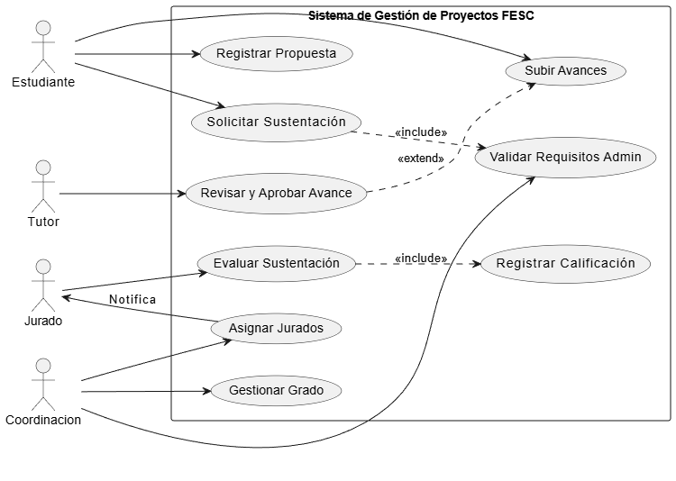
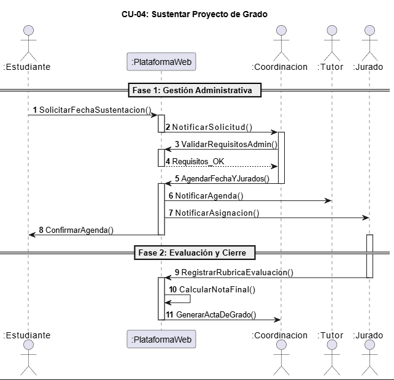
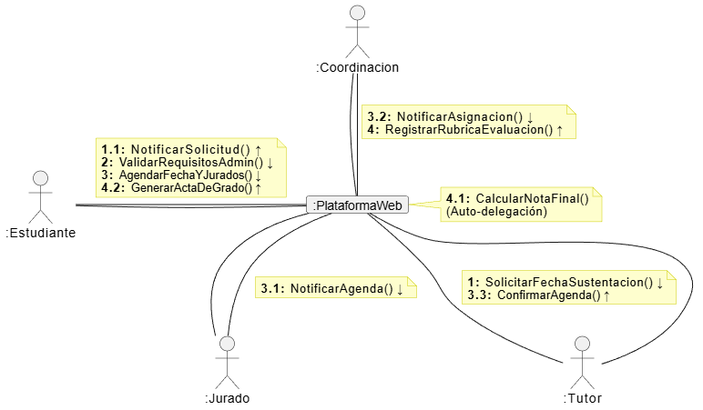

# DIAGRAMAS DINÁMICOS INTEGRADOS

> **Proyecto:** Sistema de Gestión de Proyectos de Grado FESC  
> **Integrantes:** JAIRO ANDRES RINCON BLANCO & ANDRES CAMILO CUVIDES ORTEGA  
> **Fecha:** Noviembre 2025

> **FESC**
---

## 1. Diagrama de Casos de Uso Completo y Trazabilidad

### 1.1 Descripción del Modelo
El diagrama de Casos de Uso identifica cuatro actores principales que interactúan con el "Sistema de Gestión de Proyectos FESC":

* **Estudiante:** Actor principal que inicia el ciclo de vida del proyecto.
* **Tutor:** Actor encargado de la revisión técnica y metodológica.
* **Coordinación:** Actor administrativo que valida requisitos y gestiona la logística.
* **Jurado:** Actor externo o interno encargado de la evaluación final.

### 1.2 Matriz de Trazabilidad (Requisitos vs. Casos de Uso)
*Esta tabla demuestra que el modelado cubre las necesidades del negocio.*

| ID Req | Descripción del Requisito | Caso de Uso Asociado | Actores |
| :--- | :--- | :--- | :--- |
| **RF-01** | El sistema debe permitir el registro inicial de propuestas. | Registrar Propuesta | Estudiante |
| **RF-02** | Se debe poder gestionar la carga y aprobación de avances. | Subir Avances / Revisar y Aprobar | Estudiante, Tutor |
| **RF-03** | La coordinación debe asignar jurados a los proyectos aptos. | Asignar Jurados | Coordinación |
| **RF-04** | El sistema debe gestionar la solicitud de sustentación y validar requisitos. | Solicitar Sustentación (**Include:** Validar Requisitos Admin) | Estudiante, Coord. |
| **RF-05** | Los jurados deben poder registrar la calificación en el sistema. | Evaluar Sustentación (**Include:** Registrar Calificación) | Jurado |
| **RF-06** | Se debe generar el acta de grado y cerrar el proceso. | Gestionar Grado | Coordinación |

---

## 2. Especificación Detallada del Caso de Uso Crítico

### Caso de Uso CU-04: Sustentar Proyecto de Grado

* **Actores:** Estudiante (Iniciador), Coordinación, Jurado, Tutor.
* **Precondiciones:**
    1.  El proyecto debe estar en estado **"ListoParaSustentar"** (ver Diagrama de Estados).
    2.  El estudiante debe tener el "Paz y Salvo Académico".

#### Flujo Principal (Escenario de Éxito):
1.  El **Estudiante** solicita fecha de sustentación a través de la plataforma.
2.  El **Sistema** notifica la solicitud a Coordinación.
3.  **Coordinación** valida los requisitos administrativos y agenda fecha y jurados.
4.  El **Sistema** notifica la agenda al Tutor y Jurado.
5.  El **Estudiante** confirma la recepción de la agenda.
6.  Se realiza la sustentación (evento en el mundo real).
7.  El **Jurado** registra la rúbrica de evaluación en la plataforma.
8.  El **Sistema** calcula la nota final automáticamente.
9.  El **Sistema** genera el Acta de Grado.

#### Flujos Alternativos:
* **3a. Requisitos Administrativos No Cumplidos:** Coordinación rechaza la solicitud. El caso de uso termina y el estudiante debe subsanar los pendientes.
* **8a. Nota Inferior a 3.0:** El sistema marca el proyecto como **"Reprobado"** (ver Diagrama de Estados).
* **8b. Nota entre 3.0 y 3.4:** El sistema marca el proyecto como **"Aplazado"** y solicita nuevos cambios en 15 días.

---

## 3. Modelado Dinámico: Secuencia y Comunicación

### 3.1 Análisis del Diagrama de Secuencia
El diagrama diseñado muestra la interacción temporal para el CU-04. Se ha estructurado el flujo en dos fases lógicas para manejar la complejidad:

* **Fase 1: Gestión Administrativa:** Abarca desde el mensaje `1: SolicitarFechaSustentacion()` hasta el `8: ConfirmarAgenda()`. Aquí se observa un patrón de **Controlador** donde la "PlataformaWeb" orquesta las validaciones entre el Estudiante y Coordinación.
* **Fase 2: Evaluación y Cierre:** Inicia con el registro de nota. Destaca el mensaje `10: CalcularNotaFinal()` como un método interno del sistema (auto-delegación) para asegurar la integridad de los datos antes de `11: GenerarActaDeGrado()`.

### 3.2 Equivalencia en Diagrama de Comunicación
El diagrama de comunicación valida la estructura de objetos. Se evidencia que el objeto `:PlataformaWeb` actúa como el nodo central (**Hub**) de mensajería.

> **Justificación:** Este diseño centralizado reduce el acoplamiento entre actores; por ejemplo, el Estudiante nunca se comunica directamente con el Jurado en el sistema, todo pasa por la Plataforma, garantizando la seguridad del proceso.

---

## 4. Diagrama de Estados del "Proyecto de Grado"

### 4.1 Ciclo de Vida y Estados Compuestos
El diagrama de estados cubre la vida completa del objeto "Proyecto".

* **Estado Compuesto "En Desarrollo":** Para manejar la complejidad de las revisiones iterativas, se creó un super-estado que encapsula el ciclo: `Anteproyecto` $\leftrightarrow$ `RevisiónTutor` $\leftrightarrow$ `ProyectoFinal`. Esto permite abstraer la fase de desarrollo del resto del flujo administrativo.

* **Manejo de Excepciones (Decision Point):**
    Tras el estado "ListoParaSustentar" y la transición "Sustentación Realizada", se modeló un rombo de decisión basado en guardas lógicas:
    * `[Nota < 3.0]` $\rightarrow$ Transita a **Reprobado**.
    * `[3.0 <= Nota < 3.5]` $\rightarrow$ Transita a **Aplazado** (Retorno cíclico tras 15 días).
    * `[Nota >= 3.5]` $\rightarrow$ Transita a **Aprobado**.

---

## 5. Documento de Integración y Trazabilidad (El "Glue")

* **Activación de Estados:**
    Cuando en el Diagrama de Secuencia el Jurado envía el mensaje `9: RegistrarRubricaEvaluacion()`, internamente el objeto Proyecto evalúa las guardas del Diagrama de Estados.
    El mensaje `11: GenerarActaDeGrado()` del Diagrama de Secuencia es el disparador ("trigger") que permite la transición final hacia el estado **Archivado**.

* **Consistencia de Datos:**
    Los métodos mostrados en el Diagrama de Clases (implícitos en los mensajes de Comunicación como `ValidarRequisitosAdmin()`) son los encargados de verificar las precondiciones descritas en la Especificación del Caso de Uso.

---

## 6. Análisis de Cobertura y Patrones Identificados

### 6.1 Patrones de Diseño Dinámico
* **Mediator (Mediador):** La "PlataformaWeb" actúa como mediador. Los colegas (Estudiante, Jurado, Tutor) no se refieren entre sí explícitamente, sino que se comunican a través del mediador.
* **State (Estado):** El comportamiento del sistema cambia drásticamente dependiendo del estado del proyecto. Por ejemplo, la función `SolicitarFechaSustentacion()` (Secuencia) está bloqueada si el estado no es "ListoParaSustentar" (Estados).

### 6.2 Puntos Críticos y Estrategias de Manejo
* **Punto Crítico:** El "Cuello de botella" en el estado `RevisiónTutor`.
    * **Estrategia:** El diagrama de estados permite un ciclo (loop) de correcciones, pero el sistema debe implementar alertas si el proyecto permanece en este estado por más de X días.

* **Punto Crítico:** La sincronización de agendas (Mensaje 5 en Secuencia).
    * **Estrategia:** Se modeló como un proceso asíncrono donde el sistema notifica, pero requiere confirmación (`ConfirmarAgenda`) para asegurar que el actor humano está enterado.
